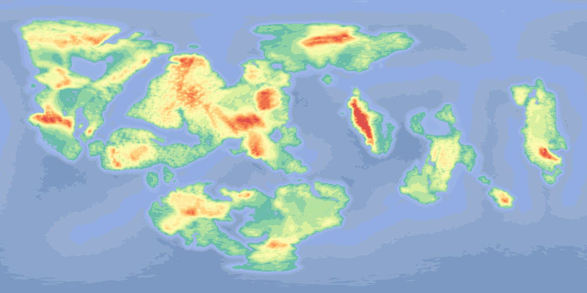
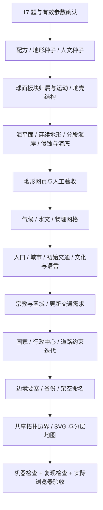

# World Atlas Engine · 架空世界地图引擎

从板块、海陆与连续地形，到水系、城市、交通、文化、宗教、国家和省份的可复现世界生成器。计算代码与 AI 工作流分离：引擎离线计算，skill 负责先问 17 个世界设定问题、解释参数、参考研究和看图验收。

当前版本 **1.2.1**，采用已认可的 **v38 分段海岸演化**，并把玩家确认的星球与人文参数写入严格的世界设置文件。新增南北极大陆独立选择和计算加速，问卷由 15 题扩展为 17 题。这不是地球地图换名，也不是调用生图模型画一张无法复算的图片。



## 下载与开始

- [下载 skill ZIP](https://github.com/yuuranku/world-atlas-engine/releases/download/v1.2.1/generate-world-atlas-skill.zip)：内含问卷、规则、下载与安装脚本。
- [下载计算 wheel](https://github.com/yuuranku/world-atlas-engine/releases/download/v1.2.1/world_atlas_engine-1.2.1-py3-none-any.whl)：供 Python/CLI 直接调用。
- [下载独立源码包](https://github.com/yuuranku/world-atlas-engine/releases/download/v1.2.1/world-atlas-engine-1.2.1-source.zip)。
- [全部附件与 SHA-256 清单](https://github.com/yuuranku/world-atlas-engine/releases/tag/v1.2.1)。

### 使用 skill

1. 解压 skill ZIP，把 `generate-world-atlas` 文件夹放入 AI 助手支持的 skills 目录，然后重新加载技能。需要能运行本地命令的宿主；只在普通网页聊天粘贴 SKILL.md 不会自动安装程序。
2. 说：`使用 $generate-world-atlas 帮我生成一个新的架空世界。`
3. 助手先一次性问 17 题；只有你明确授权才随机代选。回答并确认有效参数后，它运行安装脚本，自动下载、校验和调用固定版本引擎。
4. 先看地形网页，认可后再生成人文地图。每个版本写新目录，不覆盖旧世界。

事先安装 **Python 3.14、Node.js/npm**。已实测 Windows + Python 3.14.0 + Node 22.21.0；其他平台未完成端到端验证。首次安装需访问 GitHub Releases、PyPI 和 npm；不需要 GitHub 登录或 AI API key。引擎运行阶段不联网。

skill 的自动入口也可手动执行（在解压后的 skill 文件夹内）：

```powershell
python scripts/install_engine.py --target ./atlas-runtime
```

安装器仅创建本地虚拟环境和 renderer，不修改系统 Python/npm。输出 `atlas-runtime/runtime.json`，包含可直接调用的 Python 与 Mapshaper 绝对路径。已有环境沿用并运行 `doctor` 检查；不要对同一个目录重复安装。

包按固定 tag + SHA-256 下载，不追踪 `latest`。成功下载缓存在 `.world-atlas-downloads/1.2.1`；使用前再次校验。网络中断、文件截断或哈希不符会停止，未经验证的 wheel 不会安装。缓存需支持硬链接的本地文件系统（已测 NTFS）。已安装成功的环境可离线计算；缓存 wheel 不等于缓存了全部第三方依赖。

### 直接使用计算包

克隆仓库或解压源码包，在项目根目录执行：

```powershell
python -m venv .venv
.venv/Scripts/python.exe -m pip install .
Push-Location runtime
npm ci --ignore-scripts --no-audit --no-fund
Pop-Location
.venv/Scripts/python.exe -m world_atlas doctor --mapshaper runtime/node_modules/mapshaper/bin/mapshaper
```

以下 `python` 指刚安装的虚拟环境解释器。Windows 为 `.venv/Scripts/python.exe`；Linux/macOS 为 `.venv/bin/python`（未做跨平台位级复现承诺）。

```text
python -m world_atlas terrain --recipe examples/terrain.json --output runs/terrain-001
python -m world_atlas world --terrain runs/terrain-001 --settings examples/world-settings.json --output runs/world-001 --mapshaper runtime/node_modules/mapshaper/bin/mapshaper
python -m world_atlas verify runs/world-001
python -m world_atlas seeds --root-seed 2116268501 --count 6
```

`terrain-v38.json` 是复现样本，不是所有新世界的默认模板。改种子/已支持参数即可产生新候选；`seeds` 只挑代表种子，不表示已经通过地理和审美检查。

打开输出的 `review/index.html`。若宿主不能打开 file URL，可在该 review 目录运行 `python -m http.server 8000 --bind 127.0.0.1`，浏览器访问 `http://127.0.0.1:8000`。这是本机预览，不会自动发布到公网。

Python API 与 CLI 共用实现：

```python
from world_atlas import generate_terrain, generate_world, reproduce_world, verify_world
```

## 技术路线



详见 [技术路线与实现边界](docs/TECHNICAL_ROUTE.md)、[1.2.1 性能与两极设置实测](docs/performance-1.2.0.md)、[海岸改进记录](docs/coastline-1.1.0.md)、[历史抽取与验证](docs/VALIDATION.md)。

地形、水系和政区使用同源物理字段，不在 SVG 上另画一套地理；海岸修改发生在连续高度场的海平面切分之前。沿用现有 SVG/等高线画法。国家和省份受山地、河流、桥梁通达性、文化和实际交通网络影响；不是完整流域的机械套色。

## 可复现与限制

保存 **引擎版本 + 依赖版本 + 配方 + 地形/人文/命名种子 + 输入哈希**，不只是一个 seed。1.2.1 的极地约束改变地形；1.1.0 与 1.0.0 的海岸实现不同。

- v38 生产地形 2176×1088；上游构造参考场仍为 720×360，不宣称全部阶段同分辨率。
- 这是构造与地貌的程序化近似，不是标定过的地幔、地壳或历史政治求解器。
- 17 题不意味着任意选项已经接入计算。问卷标注已支持、叙事设定和需开发项；助手不得静默忽略答案。
- v38 已在独立目录完整复算并比对字段、PNG、等高线指纹；认可只覆盖该地形样本。其他种子、人文新生成和美术质量仍需单独验收。
- 生成时间依赖分辨率和参数；不承诺固定时长或所有平台位级一致。

## 开发和发布

`src/world_atlas` 是计算唯一源码；`skills/generate-world-atlas` 是 skill 唯一源码。个人 skills 目录中的文件是发布副本，不是第二个开发分支。

```text
python -m pip install -e .
python -m unittest discover -s tests -v
python -m pip wheel . --no-deps --wheel-dir dist
python tools/package_release.py
```

打包器固定 wheel 哈希，构建轻量 skill ZIP、源码 ZIP 和 `release-manifest.json`。历史输入留在与其匹配的旧版 Release。新版本须更新版本号、构建和测试，再创建新 tag 上传；禁止覆盖已发布 tag/附件。见 [发布流程](docs/RELEASING.md)。

本次仅公开仓库与下载，尚未指定开源许可证；不要把“公开可下载”理解为已有 MIT/Apache 等授权。第三方依赖遵守各自许可证，参考项目不自动成为本项目的许可声明。
